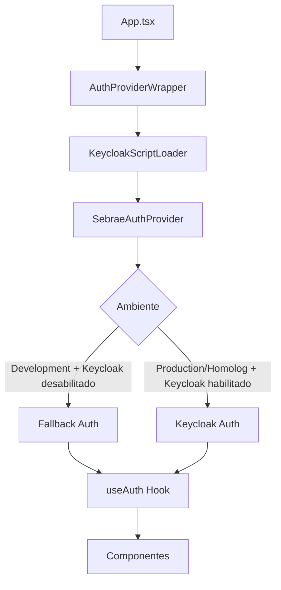

# Sistema de Autenticação Keycloak + Fallback

## 📋 Visão Geral

Sistema de autenticação inteligente que segue as instruções do Sebrae para integração com Keycloak, mas com fallback automático para desenvolvimento local.

## 🏗️ Arquitetura

### Componentes Principais

1. **SebraeAuthProvider** - Provider principal seguindo instruções do Sebrae
2. **KeycloakScriptLoader** - Carregador dinâmico do script Keycloak
3. **AuthProviderWrapper** - Wrapper de integração
4. **Hooks Customizados** - useAuth, useAuthStatus, useAuthPermissions

### Fluxo de Autenticação



## 🔧 Configuração

### Variáveis de Ambiente

#### Frontend (.env)
```env
# Ambiente
VITE_ENVIRONMENT=development

# API
VITE_API_URL=/api
VITE_DIRECTUS_URL=http://localhost:8055

# Keycloak
VITE_KEYCLOAK_URL=https://amei.sebrae.com.br/auth
VITE_KEYCLOAK_REALM=externo
VITE_KEYCLOAK_CLIENT_ID=maturidadedigital
VITE_KEYCLOAK_SSL=external
VITE_KEYCLOAK_PUBLIC_CLIENT=true
VITE_KEYCLOAK_CONFIDENTIAL_PORT=0

# Desenvolvimento
VITE_KEYCLOAK_DISABLED=true
```

### keycloak.json (Raiz do projeto)
```json
{
  "realm": "externo",
  "auth-server-url": "https://amei.sebrae.com.br/auth",
  "ssl-required": "external",
  "resource": "maturidadedigital",
  "public-client": true,
  "confidential-port": 0
}
```

## 📚 Hooks Disponíveis

### useAuth()
Hook principal para autenticação.

```typescript
const {
  isAuthenticated,
  user,
  isLoading,
  error,
  login,
  logout,
  refreshToken,
  hasRole,
  hasPermission,
  isKeycloak,
  isFallback,
  environment
} = useAuth();
```

### useAuthStatus()
Hook para status de autenticação.

```typescript
const {
  isAuthenticated,
  isLoading,
  hasError,
  error,
  isInitialized,
  isReady,
  canLogin,
  canLogout,
  canRefresh,
  environment,
  authSystem
} = useAuthStatus();
```

### useAuthPermissions()
Hook para permissões e roles.

```typescript
const {
  hasRole,
  hasPermission,
  hasAnyRole,
  hasAnyPermission,
  hasAllRoles,
  hasAllPermissions,
  userRoles,
  userPermissions,
  hasRoleAndPermission,
  hasAnyRoleAndPermission,
  hasRoleAndAnyPermission
} = useAuthPermissions();
```

### Hooks Especializados

```typescript
// Verificações específicas
const canLogin = useCanLogin();
const canLogout = useCanLogout();
const canRefresh = useCanRefresh();
const hasUserRole = useHasRole('user');
const hasReadPermission = useHasPermission('read');
const hasAnyAdminRole = useHasAnyRole(['admin', 'super-admin']);
```

## 🎯 Uso em Componentes

### Exemplo Básico

```typescript
import { useAuth } from '@/auth/useAuth';

function MyComponent() {
  const { isAuthenticated, user, login, logout } = useAuth();

  if (!isAuthenticated) {
    return <button onClick={login}>Entrar</button>;
  }

  return (
    <div>
      <p>Olá, {user?.name}!</p>
      <button onClick={logout}>Sair</button>
    </div>
  );
}
```

### Exemplo com Permissões

```typescript
import { useAuthPermissions } from '@/auth/useAuthPermissions';

function AdminPanel() {
  const { hasRole, hasPermission } = useAuthPermissions();

  if (!hasRole('admin')) {
    return <div>Acesso negado</div>;
  }

  return (
    <div>
      <h1>Painel Administrativo</h1>
      {hasPermission('user-management') && (
        <UserManagement />
      )}
    </div>
  );
}
```

### Exemplo com Loading States

```typescript
import { useAuthStatus } from '@/auth/useAuthStatus';

function AuthButton() {
  const { canLogin, canLogout, isLoading } = useAuthStatus();
  const { login, logout } = useAuth();

  if (isLoading) {
    return <div>Carregando...</div>;
  }

  if (canLogin) {
    return <button onClick={login}>Entrar</button>;
  }

  if (canLogout) {
    return <button onClick={logout}>Sair</button>;
  }

  return null;
}
```

## 🧪 Testes

### Página de Teste
Acesse `/auth-test` para testar o sistema completo.

### Componentes de Teste
- `AuthTestComponent` - Testa o AuthProvider
- `HooksTestComponent` - Testa os hooks customizados

## 🔄 Ambientes

### Development
- **Sistema:** Fallback Auth (simulado)
- **Keycloak:** Desabilitado
- **URLs:** Localhost
- **Características:** Login/logout simulado, sem necessidade de servidor Keycloak

### Production/Homologation
- **Sistema:** Keycloak real
- **Keycloak:** Habilitado
- **URLs:** Servidor Sebrae
- **Características:** Autenticação real com servidor Keycloak

## 🚀 Migração

### De AuthProvider Temporário
1. Substitua `AuthProvider` por `AuthProviderWrapper` em `main.tsx`
2. Atualize imports nos componentes
3. Use os novos hooks (`useAuth` em vez de `useAuth` antigo)

### Compatibilidade
- ✅ RequireAuth.tsx - Compatível
- ✅ AuthGroupButtons.tsx - Compatível  
- ✅ DebugAuth.tsx - Compatível
- ✅ Todos os hooks existentes - Compatíveis

## 🐛 Troubleshooting

### Erro: "Script do Keycloak não encontrado"
- Verifique se o script está carregando
- Confirme se `VITE_KEYCLOAK_DISABLED=true` em desenvolvimento

### Erro: "Sistema de autenticação não inicializado"
- Verifique se o `AuthProviderWrapper` está envolvendo a aplicação
- Confirme se as variáveis de ambiente estão corretas

### Fallback não funciona
- Verifique se `VITE_KEYCLOAK_DISABLED=true`
- Confirme se o ambiente é 'development'

## 📝 Logs

O sistema gera logs detalhados:

```
🔐 Inicializando Keycloak...
🔧 Inicializando Fallback Auth...
✅ Keycloak inicializado. Autenticado: true
✅ Fallback Auth inicializado
```

## 🔒 Segurança

- **Tokens:** Gerenciados automaticamente pelo Keycloak
- **Fallback:** Apenas para desenvolvimento, não para produção
- **CORS:** Configurado para domínios Sebrae
- **SSL:** Obrigatório em produção

---

**Sistema implementado seguindo as instruções oficiais do Sebrae com melhorias para desenvolvimento local.**
